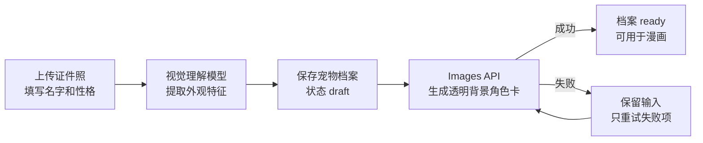
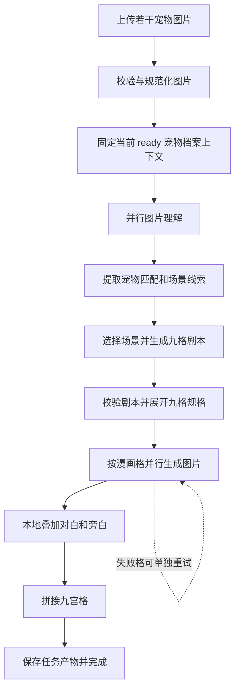
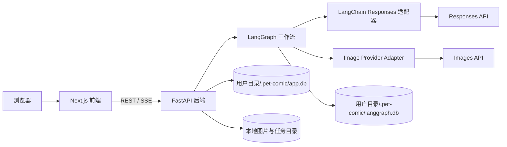

# Pet Comic

Pet Comic 是一个本机运行的宠物九宫格漫画工具。

把几张宠物照片交给它，系统会理解照片里的动作和场景，挑出适合讲故事的片段，写成九格漫画剧本，再生成一张完整的九宫格漫画。

它更像一个保存宠物日常的小工具。宠物趴在窗边、钻进纸箱、和另一只宠物挤在一起，这些普通的小事经过整理后，会变成一段可以回看的温馨故事。

## 功能

### 宠物档案

- 上传 1–3 张宠物证件照。
- 填写名字和性格。
- 使用视觉模型提取结构化外观特征。
- 使用 Images API 生成透明背景角色卡。
- 角色卡完成后，宠物档案才会进入可用状态。
- 支持角色卡版本和历史任务引用。

角色卡让同一只宠物在不同漫画格中保持相对稳定的外观。它记录的不只是名字，也为后续故事保留一个清晰的形象参考。

### 宠物照片理解

- 支持拖拽上传本地图片。
- 支持受限的 HTTP(S) 图片地址。
- 不接受 base64 作为用户输入协议。
- 识别图片中的宠物、动作、环境和有趣线索。
- 将画面中的宠物匹配到已有宠物档案。

### 九宫格漫画

- 从图片理解结果中挑选适合叙事的场景。
- 生成严格包含九格的漫画剧本。
- 每格根据剧本选择对应宠物角色卡或场景原图作为参考。
- 并行生成九张无字单格图。
- 在本地叠加对白和旁白。
- 拼接成最终九宫格漫画。

### 任务管理

- 多个任务可以排队。
- 支持取消、继续、失败项重试和单格重试。
- 节点内已经成功的图片不会因为重试而重复生成。
- 每个任务独立保存输入、理解结果、剧本、单格图片和最终产物。
- 任务和事件保存在 SQLite，图片等文件保存在本地目录。

## 技术架构

项目由两个独立进程组成：

- 后端：Python、FastAPI、LangGraph、SQLAlchemy、SQLite。
- 前端：Next.js、React、TypeScript、Tailwind CSS。
- 文本生成和视觉理解：LangChain 调用 OpenAI Responses API。
- 图片生成：项目自己的 Image Provider Adapter 调用官方 OpenAI SDK Images API。
- 工作流检查点：单独使用 LangGraph SQLite 存储。

## 技术流程

### 宠物建档流程



### 漫画任务流程



### 整体调用关系



## 目录结构

```text
pet-comic/
├─ backend/
│  ├─ app/
│  ├─ prompts/              # LangGraph 节点提示词
│  ├─ pyproject.toml
│  └─ README.md
├─ frontend/                # Next.js 前端
├─ backend/.env.example     # 运行参数示例
├─ docs/                    # 项目设计与技术设计
├─ backend/.env.example     # 运行参数示例
└─ README.md
```

## 配置

复制示例配置：

```powershell
Copy-Item backend/.env.example backend/.env
```

`backend/.env` 用于配置图片限制、任务并发、请求超时和日志。默认数据目录为当前用户目录下的 `.pet-comic`，供应商、API Key 和模型绑定保存在该目录的 `app.db`，不写入 `.env`。

## 启动

### 后端

```powershell
cd backend
uv sync
uv run uvicorn app.main:app --reload
```

### 前端

```powershell
cd frontend
npm install
npm run dev
```

前端开发服务器默认通过 `/api` 代理到本地 FastAPI 后端。
